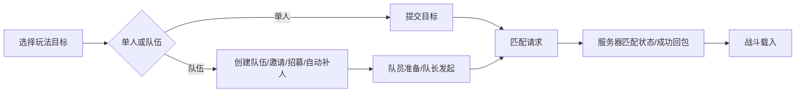

# 《弹弹星球》外围系统、成长、匹配与局内流程（本机代码研究）

研究日期：2026-09-30。来源是当前微信小游戏本机缓存，AppID `wx64969d55b91a6963`，包版本目录 `242`。主体 `__WITHOUT_MULTI_PLUGINCODE__.wxapkg` 的 SHA-256 为 `3b8ab533d6ae2c4e9630149e0bd30b6647c15c92a5d5e405154debcd3d2392a8`。游戏为 Unity 客户端，Lua 逻辑位于 `res/Zero/Lua/*.ab`。本次从缓存中的 23 个 Lua AssetBundle 提取了 8,272 个 TextAsset 字节码，选取系统入口、配置和战斗模块做反编译。以下“代码确认”指客户端代码/配置存在，不等于当前服务器一定开放该功能。

## 一句话框架

`角色升级与养成 → 解锁/进入 PvP、赛季与副本入口 → 单人或组队匹配 → 回合制弹射战斗 → 服务端结果与奖励 → 再投入养成`。

## 1. 外围系统

| 系统层 | 代码证据 | 作用与关系 |
| --- | --- | --- |
| 功能解锁 | [`open_func` 常量](decompiled/game.module.open_func.manager.const.lua)、[`open_func` 表](decompiled/auto_gen.package_include.config.open_func.open_func.lua)、[`is_open`](decompiled/game.module.open_func.manager.core.lua) | 主界面入口受等级、开服天数、分支条件及服务端状态控制。代码里的功能不代表当前角色已经开放。 |
| 日常循环 | [`task` 管理器](decompiled/game.module.task.manager.core.lua)、[`task_liveness`](decompiled/auto_gen.package_include.config.task_liveness.task_liveness.lua) | 主线/日常/联盟日常任务，活跃度与可领取状态驱动红点和奖励回收。 |
| 资源入口 | [`main_view` 底部配置](decompiled/game.module.main_view.manager.config.bottom_btn_config.lua)、[`右上配置`](decompiled/game.module.main_view.manager.config.right_up_config.lua)、[`shop`](decompiled/game.module.shop.manager.core.lua)、[`gacha`](decompiled/game.module.gacha.manager.data.data.lua) | 武器、技能、公会、组队、日常、商店、福利、抽卡等入口连接战斗与养成。 |
| 社交与身份 | [`team.const`](decompiled/game.module.team.manager.const.lua)、`game.module.friend`、`game.module.alliance`、`game.module.home`、`game.module.dress_up`、`game.module.title` | 好友/邀请/公会/家园/装扮/称号。后五项已确认有独立客户端模块；具体产出与当前开放状态需按各系统继续核对。 |
| 赛季与排位 | [`season` 管理器](decompiled/game.module.season.manager.core.lua)、[`排位段位`](decompiled/auto_gen.package_include.config.ranked_match_rank.ranked_match_rank.lua)、[`段位奖励`](decompiled/auto_gen.package_include.config.ranked_match_rank_reward.ranked_match_rank_reward.lua) | 排位段位、赛季信息、胜场/参与奖励、段位奖励与赛季结算。2v2、3v3 和杯赛在客户端有不同配置/入口。 |

**可核对的解锁例子。** `open_func` 表写明：扭蛋 `3601` 的提示为角色 2 级、武器升星 `2235` 为角色 6 级、日常任务 `23` 与排行榜 `1901` 为角色 10 级、战令 `5901` 为角色 18 级；宠物 `1801` 同时标有开服第 2 天和角色 25 级。武器强化 `2208` 的提示是达到“士兵Ⅲ”头衔。它们是缓存版本的客户端配置，服务端仍可控制可见/开放。

## 2. 成长结构

1. **角色等级与基础属性。** [`exp.player`](decompiled/auto_gen.package_include.config.exp.player.lua) 记录 `level`、升级 `exp`、`day_max_exp`、`extra_attr_points`、`base_attrs`、`attr_points`；[`role_property`](decompiled/auto_gen.package_include.config.role_property.role_property.lua) 把 `level`、`exp`、`attrs` 等作为角色字段。等级既提供数值，也解锁外围系统。
2. **装备/武器。** [`main_weapon_develop.data`](decompiled/game.module.main_weapon_develop.manager.data.data.lua) 管理已拥有武器、穿戴槽位、武器星级、技能和评分，含自动穿戴/筛选穿戴；[`weapon_star`](decompiled/auto_gen.package_include.config.weapon_star.weapon_star.lua)、[`weapon_strength`](decompiled/auto_gen.package_include.config.weapon_strength.weapon_strength.lua) 分别定义升星与强化层。`equip_strengthen`、`equip_stone`、`equip_skill`、`weapon_enchant` 等还有独立配置，说明养成不止单一战力数值。
3. **技能/宠物。** `skill_base_upgrade` 按等级列消耗，`pet_level` 定义宠物经验、属性与评分系数；局内 [`skill.core`](decompiled/game.module.fight.manager.base.fighting.skill.core.lua) 又检查技能存在性、禁用状态、CD、消耗与本回合限制。因此局外技能与宠物培养会进入局内能力体系，但某个模式是否平衡数值，要按对应玩法配置判断。
4. **赛季成长。** [`ranked_match_rank`](decompiled/auto_gen.package_include.config.ranked_match_rank.ranked_match_rank.lua) 有 `rank_id`、`star`、`rank_equal_star`、`next_id`、`last_id`、`next_season_id`、`lose_protect_daily`。也就是说段位与星级是独立于角色等级的进度，并带赛季继承字段。`ranked_match_rank_type` 共列出 9 个大段位图标类型；这里未把配置键误写成游戏内中文段位名。
5. **资源回流。** 日常/活跃度、排位参与与获胜奖励、赛季段位奖励、商店/抽卡，以及战斗结算一起提供养成材料。`ranked_match_misc` 中 `attendance_award_times=3`、`victory_award_times=2`、`attendance_award_fundamental_exp=343` 是客户端配置键值；奖励是否已领、何时重置由服务端状态决定。

## 3. 匹配链路

- [`team.const`](decompiled/game.module.team.manager.const.lua) 区分 `role_status`、`team_status` 与 `teammate_status`，并将目标分成 PvP、PvE、赛季 2v2/3v3、自由房等。队伍条件类型含职业、段位、杯数、密码；自由房配置还有地图、环境和时长选项。它们是模式/入口枚举，**不能据此认为所有模式在当前服同时开放**。
- [`team.network`](decompiled/game.module.team.manager.network.network.lua) 明确有创建/退出/邀请/申请/招募/自动匹配/取消/准备/开始匹配的 `c2s` 与对应 `s2c`。`team_auto_match_c2s` 传 `type`、`target`、`arg`、`extend_type`；`team_open_match_c2s` 传 PvP 目标；`team_match_stat_c2s` 使用玩法 `play_type` 和 `max_count`。[`season.network`](decompiled/game.module.season.manager.network.network.lua) 另接收 `season_match_succ_s2c`。
- [`team_misc`](decompiled/auto_gen.package_include.config.team_misc.team_misc.lua) 有 `team_match_life=300`、`team_match_auto_note=15`、`team_match_cd=1`、`match_diff=2` 等字段。字段名提示它们影响队伍匹配生命周期/提示/冷却，但没有服务端实现与完整引用链，不把数值直接断言为实际匹配等待秒数或段位差。
- **服务端边界：** 本机客户端未提供真实匹配池筛选、隐藏分、机器人填充时机、跨服扩圈算法、最终胜负与奖励发放规则。客户端可以看到“提交目标 → 等待/取消 → 成功回包”，无法把配置字段当作服务器算法。

## 4. 局内流程

1. **进入与加载。** [`fight.base.core`](decompiled/game.module.fight.manager.base.core.lua) 接收 `cfg_battle_id`、玩法类型、地图/环境和客户端类型，状态从 `loading` 切到 `fighting`，支持断线重连。相应消息在 [`fight.base.network`](decompiled/game.module.fight.manager.base.network.lua) 注册。
2. **新回合。** [`round.core`](decompiled/game.module.fight.manager.base.fighting.round.core.lua) 的 `enter_new_round` 接收服务器 `turn`、`round`、`round_stime`、`wind`、`action_list`，刷新当前行动单位与时间。风力进入弹道因子计算：`cur_wind = wind * 0.1`，随后乘战斗配置的 `wind_power_factor`、`weather_factor`。
3. **玩家行动。** [`fire.core`](decompiled/game.module.fight.manager.base.fighting.fire.core.lua) 管按住蓄力、角度、力度与发射请求；[`skill.core`](decompiled/game.module.fight.manager.base.fighting.skill.core.lua) 管技能是否可用、CD、消耗及禁用状态；[`cmd.network`](decompiled/game.module.fight.manager.base.fighting.cmd.network.lua) 把发射/技能组织成带回合号的指令，并解析服务器的确认与战斗节点。
4. **弹体与回合结束。** [`bullet.core`](decompiled/game.module.fight.manager.base.fighting.bullet.core.lua)、[`round.perform`](decompiled/game.module.fight.manager.base.fighting.round.perform.lua) 处理弹体、命中/位移等表现与回合过程。`round.core` 的行动计时器更新倒计时；超时可走 `guaranteed_fire` 自动发射逻辑，否则在满足条件时请求跳过回合。该自动发射受玩法配置和当前角色状态限制，不能概括为所有模式都会自动开火。
5. **结算与退出。** [`ending.core`](decompiled/game.module.fight.manager.base.ending.core.lua) 收到 `battle_result_s2c` 后进入 `ending`，根据 `win_camp_id == self_camp` 判本方胜利，再执行结算展示/MVP/退出链。输赢与结算消息来自服务端；[`battle_result_board`](decompiled/auto_gen.package_include.config.battle_result_board.battle_result_board.lua) 配不同结果展示。

## 证据边界与复现

- Lua 包是已编译且剥离调试信息的字节码。`decompiled/` 为研究用反编译结果，部分大函数出现临时变量丢失或提前截断；以函数名、字段、消息名和多处调用相互印证。`lua-assets/manifest.json` 保留每个字节码的 AssetBundle、TextAsset 名和路径。不要把反编译中的 `L0_0` 临时变量当原始源码变量。
- 客户端配置含历史/预埋玩法。当前账号、当前服的入口开放与动态数值需要服务端回包验证；本次按用户要求停止了 UI 操作。
- 复现：`python tools/extract_lua_assets.py <本机 res/Zero/Lua 目录> lua-assets`；再用 `python tools/decompile_selected.py lua-assets decompiled --java <java.exe> --jar vendor/unluac.jar`。`tools/inspect_wxapkg.py` 可验证微信包成员与 SHA-256。

